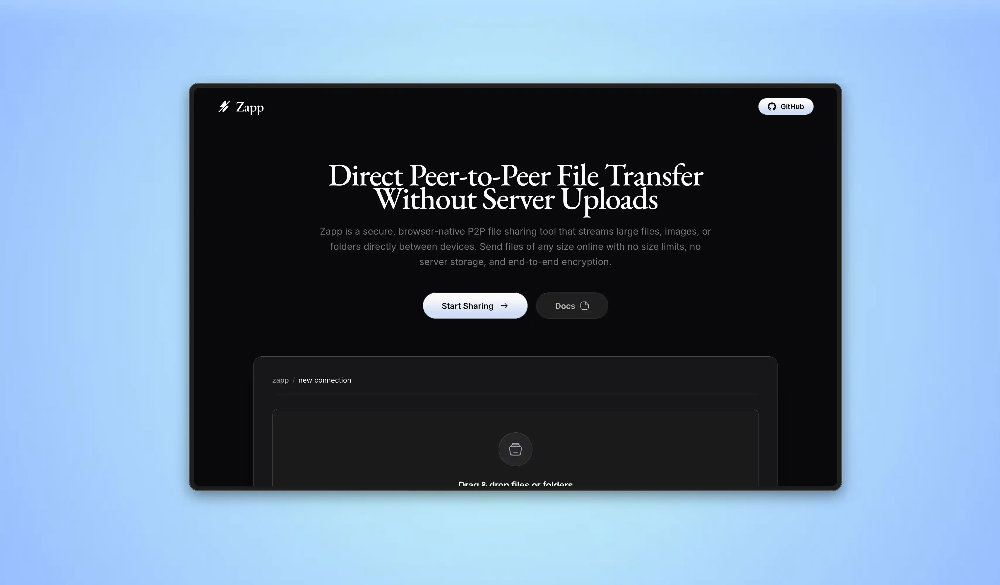

# Zapp — Secure, Browser-Native P2P File & Clipboard Sharing

Zapp is a production-grade, zero-friction, browser-native peer-to-peer (P2P) file and text transfer platform. Built with modern web standards, Zapp establishes direct, encrypted communication tunnels between web browsers utilizing WebRTC. This architecture completely eliminates intermediate server uploads, offering absolute digital privacy and unmatched transfer speeds.



## Core Features & Capabilities

*   **Serverless P2P Streaming:** Data streams directly from the sender's local storage to the receiver's local storage using WebRTC SCTP DataChannels.
*   **Arbitrary File Size Support:** Features a custom client-side streaming engine that slices payloads into dynamic memory chunks (16KB to 64KB). This prevents browser tab crashes or RAM exhaustion, enabling gigabyte-scale transfers.
*   **Secure Text & Link Clipboard:** Instantly share texts, code blocks, or URLs with connected peers, protected under the same end-to-end security model.
*   **Real-Time Telemetry:** Visual indicators for byte-level progress tracking, current throughput (MB/s), elapsed duration, and high-accuracy ETA calculations.
*   **Zero-Knowledge Architecture:** No files, file metadata, or user identities are ever written to disk or stored in any database. The signaling server is solely used to facilitate the handshake and is disconnected once the P2P channel is established.
*   **Premium Visual Experience:** A highly optimized dark-mode UI with subtle micro-animations (Framer Motion), clean typography, and a mobile-friendly responsive layout.

---

## Technical Architecture

Zapp relies on a lightweight signaling server for initial peer discovery and connection negotiation (NAT traversal), after which all communication happens directly between the clients.

```mermaid
sequenceDiagram
    autonumber
    participant Sender as Sender Browser
    participant Signaling as WebSocket Signaling (HF)
    participant Receiver as Receiver Browser

    Note over Sender, Signaling: Peer Registration
    Sender->>Signaling: Request Room Creation
    Signaling-->>Sender: Return 6-Digit Room Code

    Note over Receiver, Signaling: Discovery
    Receiver->>Signaling: Join Room with 6-Digit Code
    Signaling-->>Sender: Notify: Receiver Joined

    Note over Sender, Receiver: WebRTC Handshake (SDP & ICE Exchange)
    Sender->>Signaling: Transmit SDP Offer & ICE Candidates
    Signaling->>Receiver: Forward SDP Offer & ICE Candidates
    Receiver->>Signaling: Transmit SDP Answer & ICE Candidates
    Signaling->>Sender: Forward SDP Answer & ICE Candidates

    Note over Sender, Receiver: Direct Connection Established
    Signaling-->>Sender: Disconnect
    Signaling-->>Receiver: Disconnect
    
    rect rgb(20, 20, 25)
        Note over Sender, Receiver: Direct P2P Channel (E2EE)
        Sender->>Receiver: Stream Binary File Slices / Clipboard Data
    end
```



### Protocol Details
- **Signaling Layer:** Implemented on Node.js using the high-performance `ws` library.
- **Connection Negotiation:** WebRTC PeerConnections exchange Session Description Protocol (SDP) configurations and Interactive Connectivity Establishment (ICE) candidates.
- **Network Traversal:** Public STUN servers are queried to determine public IP addresses and ports, successfully bypassing most symmetric and asymmetric domestic NAT/Firewall configurations.

---

## Security & Encryption Model

Security is baked directly into the protocol:
1.  **End-to-End Encryption (E2EE):** Data is encrypted at the source browser using Datagram Transport Layer Security (DTLS) and decrypted only at the target browser. 
2.  **No Server Persistence:** Because files are sent as raw binary buffers directly over SCTP sockets, they are never cached or written to any physical storage media during transit.
3.  **No Tracking:** Zapp has no database, utilizes no user tracking pixels, does not set persistent cookies, and respects the absolute privacy of users.

---

## Directory Structure

The repository is organized into a clean monorepo structure:
```text
zapp/
├── frontend/             # Vite + React (TypeScript) Application
│   ├── public/           # Static assets, sitemap, robots, manifest, favicons
│   └── src/              # React components, hooks, and page layout
├── signaling/            # Node.js WebSocket signaling server
└── package.json          # Root scripts to orchestrate local development
```

---

## Local Development & Setup

### Prerequisites
- Node.js (v18.0.0 or higher)
- npm (v9.0.0 or higher)

### Step-by-Step Installation

1.  **Clone the Repository:**
    ```bash
    git clone https://github.com/dqev/zapp.git
    cd zapp
    ```

2.  **Install Monorepo Dependencies:**
    Installing dependencies at the root will automatically resolve workspaces and configure dependencies for both the frontend and the signaling server.
    ```bash
    npm install
    ```

3.  **Run Development Environment:**
    Start both the frontend client and the backend signaling server concurrently:
    ```bash
    npm run dev
    ```

4.  **Open the Web App:**
    Vite will expose the app. Navigate to:
    ```text
    http://localhost:5173
    ```

---

## Production Deployments

The live service is split across two production deployment environments:

### 1. Frontend Web Client (Vercel)
- **Deployment URL:** [https://zapp.devchauhan.in](https://zapp.devchauhan.in)
- Built with a static optimization pipeline, automatically serving site manifests, SEO tags, sitemaps, and robots configuration.

### 2. Signaling Server (Hugging Face Spaces)
- **Deployment URL:** `wss://devchauhann-zapp.hf.space`
- Deployed inside a Docker container on Hugging Face Spaces. It runs an HTTP wrapper with a `/health` endpoint to pass the platform's load balancer checks and listens on port `7860`.

---

## License

This project is licensed under the MIT License. See [LICENSE](LICENSE) for details.


