# Zapp — Secure, Browser-Native P2P File Broadcasting

Zapp is a production-grade, zero-friction, browser-native peer-to-peer (P2P) file and text transfer platform. Built on WebRTC, Zapp establishes direct, encrypted tunnels between web browsers — completely eliminating server uploads. Now with **1-to-many broadcast mode**: one host can stream files simultaneously to up to 10 receivers.


---

## What's New

| Feature | Status |
|---|---|
| **1-to-Many Broadcast** | ✅ Host broadcasts files to up to 10 receivers simultaneously |
| **Bulk File Upload** | ✅ Drop entire folders — all files are queued and sent in sequence |
| **Pause / Resume / Cancel** | ✅ Per-file flow control with full pump restart |
| **256 KB Chunks + 4 MB Buffer** | ✅ ~16× faster than legacy 16 KB chunk size |
| **Auto ICE Restart** | ✅ Reconnects on network drops (3 retry attempts) |
| **Room Full Detection** | ✅ Red "room full" badge — no silent failure |
| **Recipient Send-Back** | ✅ Receivers can upload files back to the host |
| **Memory-Safe Object URLs** | ✅ All blob URLs revoked on unmount (no memory leak) |

---

## Core Features & Capabilities

- **1-to-Many Broadcast:** The first peer to join becomes the host/broadcaster. Each subsequent peer becomes a receiver. The host maintains an independent `RTCPeerConnection + DataChannel` per receiver and sends files to all receivers simultaneously, with independent flow control per peer.
- **Serverless P2P Streaming:** Data streams directly browser-to-browser using WebRTC SCTP DataChannels. Files never touch a server.
- **Unlimited File Size:** A custom streaming engine slices files into 256 KB chunks using `Blob.slice().arrayBuffer()` (Promise-based, no stale FileReader handlers). Buffer backpressure is managed via `bufferedAmountLowThreshold`.
- **Bulk Upload + Folder Support:** Drop multiple files or entire folder trees. Folders are recursively expanded via the FileSystem API. All items are queued and sent in sequence.
- **Pause / Resume / Cancel:** Per-file flow control. Pausing a file sleeps the send pump via a Promise resolved by `resumeTransfer()`. Cancel propagates to all connected receivers.
- **Real-Time Telemetry:** Per-file progress, transfer speed (bytes/sec), and ETA calculated every 300ms.
- **Zero-Knowledge Architecture:** No files, metadata, or identities ever stored. Signaling server only facilitates the handshake.
- **Auto-Reconnect:** ICE restart is attempted up to 3 times on connection failure before giving up cleanly.

---

## Technical Architecture

### Broadcast Topology (Star / Hub Model)

```
              ┌─────────────────────────┐
              │    HOST / BROADCASTER   │  ← First peer to join
              └────┬────────┬────────┬──┘
                   │        │        │
              [Peer A]  [Peer B]  [Peer C]  ... (up to 10)
```

Each receiver gets a dedicated `RTCPeerConnection`. Files are sent independently to each peer — a slow receiver never blocks others.

### WebRTC Signaling Flow

```mermaid
sequenceDiagram
    autonumber
    participant Host as Host Browser
    participant Signaling as WebSocket Signaling
    participant R1 as Receiver 1
    participant R2 as Receiver 2

    Note over Host, Signaling: Room Creation
    Host->>Signaling: join(roomId) — becomes host
    Signaling-->>Host: joined { isHost: true, peers: [] }

    Note over R1, Signaling: Receiver 1 joins
    R1->>Signaling: join(roomId)
    Signaling-->>R1: joined { isHost: false, hostId }
    Signaling-->>Host: peer-joined { peerId: R1 }

    Note over Host, R1: WebRTC Handshake (SDP + ICE)
    Host->>Signaling: signal(offer) → R1
    Signaling->>R1: forward offer
    R1->>Signaling: signal(answer) → Host
    Signaling->>Host: forward answer

    Note over Host, R2: Receiver 2 joins — same flow
    R2->>Signaling: join(roomId)
    Signaling-->>Host: peer-joined { peerId: R2 }
    Host->>R2: new RTCPeerConnection (independent)

    rect rgb(20, 20, 25)
        Note over Host, R2: Direct P2P Channels (DTLS-E2EE)
        Host->>R1: stream file chunks (256KB each)
        Host->>R2: stream file chunks (independent pump)
    end
```



### Protocol Details

| Layer | Technology | Detail |
|---|---|---|
| Signaling | Node.js `ws` | WebSocket, JSON, heartbeat every 25s |
| NAT traversal | STUN (6 servers) + TURN (3 OpenRelay) | Pre-gathered ICE candidates (`iceCandidatePoolSize: 10`) |
| Data transport | WebRTC SCTP DataChannel | `ordered: true`, 256 KB chunks, 4 MB buffer |
| Encryption | DTLS 1.2/1.3 | Mandatory per WebRTC spec |
| Backpressure | `bufferedAmountLowThreshold = 512 KB` | Pump sleeps/wakes via `onbufferedamountlow` |

---

## Performance Tuning

| Parameter | Value | Reason |
|---|---|---|
| `CHUNK_SIZE` | 256 KB | Max safe DataChannel chunk (browser-tested) |
| `BUFFER_HIGH_WATERMARK` | 4 MB | Keep OS send buffer full for max throughput |
| `BUFFER_LOW_WATERMARK` | 512 KB | Resume before the queue starves |
| `STATS_INTERVAL_MS` | 300 ms | Smooth UI updates without excessive re-renders |
| `MAX_ICE_RESTARTS` | 3 | Retry cap prevents infinite restart loops |
| `iceCandidatePoolSize` | 10 | Pre-gather candidates for sub-100ms connect |

---

## Security & Encryption Model

1. **End-to-End Encryption (E2EE):** DTLS encryption is mandatory in the WebRTC spec. Data is encrypted at the source and decrypted only at the destination — signaling server has no payload visibility.
2. **No Server Persistence:** Binary buffers are streamed over SCTP sockets directly — never cached or written to any storage during transit.
3. **No Tracking:** No database, no analytics, no cookies, no persistent identifiers. The signaling server only holds in-memory `Map<roomId, Map<peerId, WebSocket>>` which is wiped when peers disconnect.
4. **Room Isolation:** Each room is a 6-digit numeric code. The server enforces a maximum of 10 peers per room and rejects joiners with a typed `error` message.

---

## Directory Structure

```text
zapp/
├── frontend/                    # Vite + React (TypeScript)
│   └── src/
│       ├── hooks/
│       │   └── useWebRTC.ts     # WebRTC engine: star topology, send pump, flow control
│       ├── components/
│       │   ├── ActiveWorkspace.tsx  # Room UI, peer count badge, share panel
│       │   ├── TransferStats.tsx    # Per-file progress, pause/resume/cancel
│       │   ├── Dropzone.tsx         # Multi-file + folder drag-and-drop
│       │   ├── Features.tsx         # Feature grid section
│       │   ├── Docs.tsx             # Technical documentation page
│       │   └── ...
│       └── utils/
│           └── format.ts        # formatBytes, formatTime (NaN-safe)
├── signaling/
│   └── server.js                # Node.js WS server: host tracking, room cap, broadcast
└── package.json                 # Root scripts (concurrent dev)
```

---

## Local Development & Setup

### Prerequisites
- Node.js v18+
- npm v9+

### Installation

```bash
# 1. Clone
git clone https://github.com/dqev/zapp.git
cd zapp

# 2. Install all workspace dependencies
npm install

# 3. Run frontend + signaling concurrently
npm run dev
```

Open: `http://localhost:5173`

### Environment Variables (optional)

| Variable | Default | Description |
|---|---|---|
| `VITE_TURN_URL` | — | Custom TURN server URL (e.g. `turn:my-server.com:3478`) |
| `VITE_TURN_USERNAME` | — | TURN credential username |
| `VITE_TURN_CREDENTIAL` | — | TURN credential password |
| `MAX_PEERS` | `10` | Max peers per room (signaling server) |
| `PORT` | `7860` | Signaling server port |

---

## Production Deployments

### Frontend (Vercel)
- **URL:** [https://zapp.devchauhan.in](https://zapp.devchauhan.in)

### Signaling Server (Hugging Face Spaces)
- **URL:** `wss://devchauhann-zapp.hf.space`
- Runs in Docker, exposes `/health` for load balancer probes, listens on port `7860`

---

## License

MIT License. See [LICENSE](LICENSE) for details.
